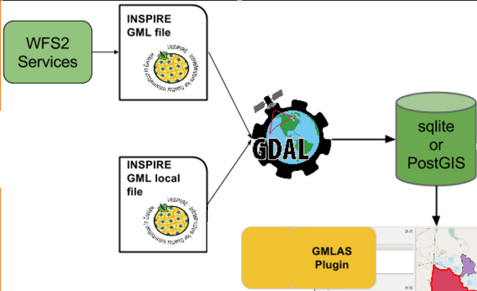

# GML Application Schema toolbox QGIS plugin

This QGIS 3 plugin provide the capabilities to:

* Download GML from WFS 2 services
* Read GML App Schema files in XML mode
* Convert GML App Schema files in PostGIS and SQLite format
* Export PostGIS and SQLite format to GML App Schema files

The technical and user documentation is here: <https://brgm.github.io/gml_application_schema_toolbox/>

----

## Authors

The plugin has been funded by:

* [BRGM](http://www.brgm.eu/) - BRGM is involved for a long time in the definition of interoperability standards especially linked to OGC and the European INSPIRE directive initiatives.
* [European Union's Earth observation programme Copernicus](http://www.copernicus.eu/), as part of the tasks delegated to the European Environment Agency

The plugin has been developed by [Oslandia](https://www.oslandia.com/), [Camptocamp](https://www.camptocamp.com/) and rely on [OGR GMLAS driver](https://www.gdal.org/drv_gmlas.html) developed by [Spatialys](https://www.spatialys.com/).

Thanks to all [contributors](https://github.com/BRGM/gml_application_schema_toolbox/graphs/contributors).

----

## License

The project license is [GPLv2+](LICENSE).
