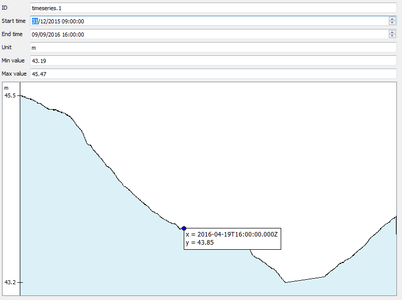

GML application schema toolbox
==============================

This is a prototype implementation of a toolbox designed to manipulate Complex Features.

It mainly consists of a QGIS plugin that is able to import Complex Features in two modes:

  * native XML mode
  * relational mode (where the XML is first converted into a database, thanks to the PyXB library)
 
In native XML mode, the standard QGIS attribute form is extended with a widget that displays an interactive XML tree (allowing the user to resolve xlink:href elements)

In relational mode, the application schema is first translated into a set of linked tables in a spatialite database. Some options can be set by the user to define the way tables and columns are created out of the XSD schemas.

The whole relational model allows configuration of QGIS, the relations between tables, and the types of edit widgets used for columns. This allows the use of the standard QGIS form for navigation of the relational model.

This QGIS prototype also explores a functionality for developers to provide custom viewer widgets for some element types. For example, timeseries of a WaterML2 stream is better seen as a plot diagram rather that as a list of values.

A prototype API allows developers to extend this mecanism to any kind of complex type.

Directories
-----------

The [gml_application_schema_toolbox](gml_application_schema_toolbox) contains the QGIS plugin sources.

The [samples](samples) directory contains sample Complex Features streams.

The [doc](doc) directory contains some documentation on the project.

Authors
-------

This plugin has been funded by BRGM and developed by Oslandia

License
-------

GPLv2+
