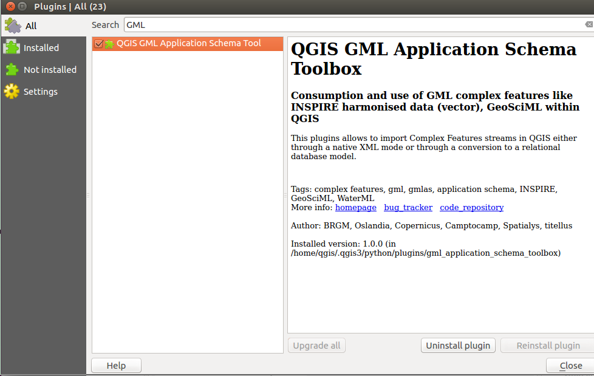
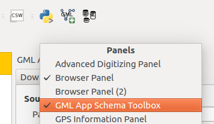

# Plugin installation

## From QGIS

Use [QGIS plugin manager](http://docs.qgis.org/2.14/en/docs/training_manual/qgis_plugins/fetching_plugins.html) to install the plugin from the repository.





## From sourcecode

The plugin source code is available here: https://github.com/brgm/gml_application_schema_toolbox


# Plugin main window

To open the plugin panel, right click on the toolbars to add the ```GML App Schema Toolbox``` panel.




* [Download](DOWNLOAD.md)
* [Read](READ.md)
 * [Read in XML mode](READ-XML-MODE.md)
 * [Read in database (relational) mode](READ-DB-MODE.md)
 * [Browse custom elements](READ-CUSTOM.md)
* [Write](WRITE-FROM-DB.md)
