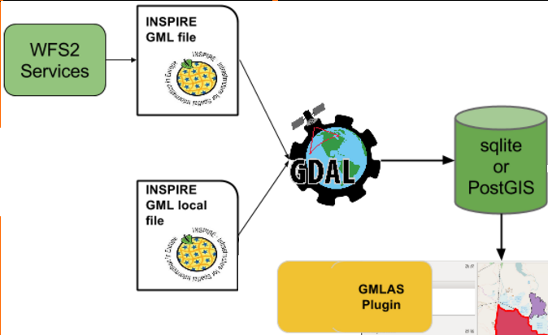

# GML Application Schema toolbox QGIS plugin

This QGIS plugin provide the capabilities to:

* [Download GML from WFS 2 services](DOWNLOAD.md)
* [Read GML App Schema files in XML mode](READ-XML-MODE.md)
* [Convert GML App Schema files in PostGIS and SQLite format](READ-DB-MODE.md)
* [Export PostGIS and SQLite format to GML App Schema files](WRITE-FROM-DB.md)

This plugin works with QGIS3+.

## Context

In the context of the definition of interoperability standards especially linked to OGC and the European INSPIRE directive initiatives, existing tools being limited for an easy exploitation of these standards, this project aims at developing a QGIS plugin relying on OGR library to deal with GML Application Schema datasets.

In particular, the aim is to develop tools to **manipulate Complex Features streams in a GIS desktop application**.

[ISO19109](http://www.iso.org/iso/catalogue_detail.htm?csnumber=39891) defines in its General Feature Model, the notion of FeatureType. Each domain can define its own application schema of FeatureTypes by reusing or extending the base types. Thus, used to describe and exchange domain related content, a FeatureType based information flow is often really rich in its datastructure. The new data structure often leads to the generation of a XSDs; basis of XML exchanges (eg. [INSPIRE data specification XSD](http://inspire.ec.europa.eu/XML-Schemas/Data-Specifications/2892)). “Complex Feature” term is used as opposed to “Simple Feature” (cf. [OGC® 10-100r3](http://portal.opengeospatial.org/files/?artifact_id=42729)), a subset of XML-Schema and GML to lower the “implementation bar” restricting spatial/non-spatial property types, cardinality of properties...

Complex Features streams are natively represented by an XML content which allows, thanks to its hierarchical structure, to express an instance coming from a rich object model. Although being developed and tested on a fixed subset of application schemas, this project aims at being generic and adaptable to any (valid) application schema. We do not want to limit a priori the rich possibilities offered by the Complex Features object model. Possible problems of performances and limit in model complexity will have to be determined as soon as possible.

## Table of content

* [Overview](OVERVIEW.md)
* [Download](DOWNLOAD.md)
* [Read](READ.md)
 * [Read in XML mode](READ-XML-MODE.md)
 * [Read in database (relational) mode](READ-DB-MODE.md)
 * [Browse custom elements](READ-CUSTOM.md)
* [Write](WRITE-FROM-DB.md)

## Example & samples

Most of the example below are based on:

* INSPIRE Environmental Monitoring Facility WFS flow on BRGM piezometers,
* GroundWaterML2.0 WFS flow on French aquifer reference dataset (BD LISA),
* SOS flows on the groundwater level measurements acquired by the piezometers monitoring those aquifers.

## Authors

The plugin has been funded by:
* [BRGM](http://www.brgm.fr/) - BRGM is involved for a long time in the definition of interoperability standards especially linked to OGC and the European INSPIRE directive initiatives.
* [European Union's Earth observation programme Copernicus](http://www.copernicus.eu/), as part of the tasks delegated to the European Environment Agency

The plugin has been developed by [Oslandia](http://www.oslandia.com/), [Camptocamp](http://www.camptocamp.com/) and rely on [OGR GMLAS driver](http://www.gdal.org/drv_gmlas.html) developed by [Spatialys](http://www.spatialys.com/).

Thanks to all [contributors](graphs/contributors).

## License

The project license is GPLv2+.
