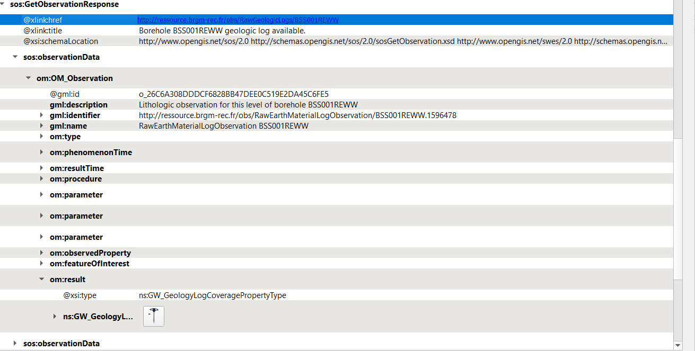
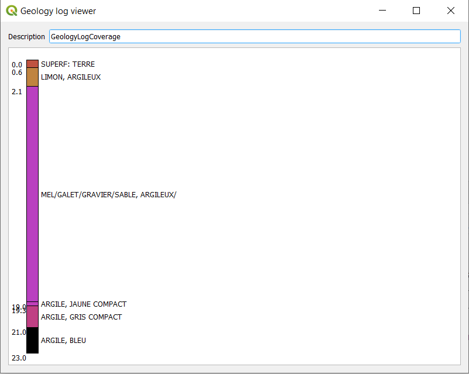
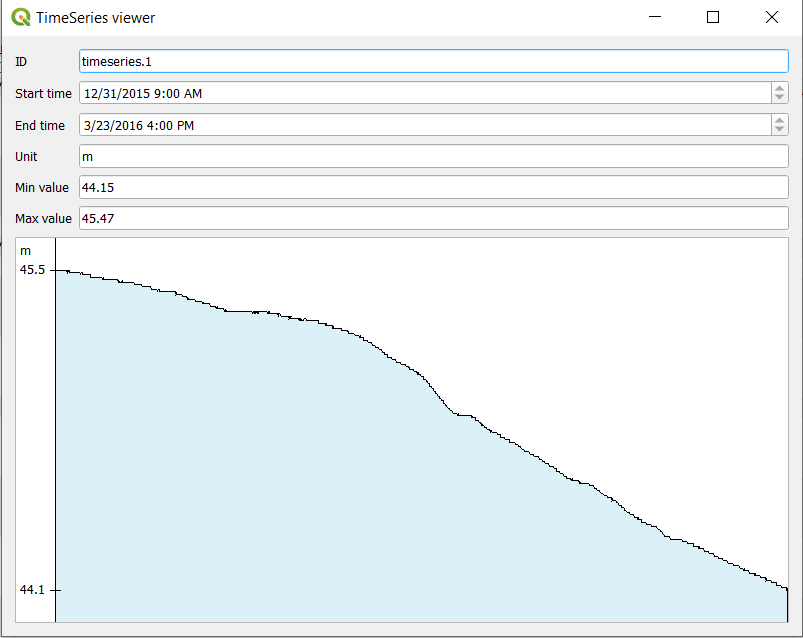
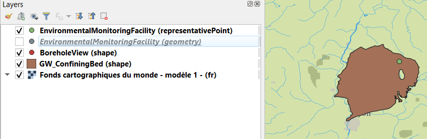

# XML Mode - local test scenario
This scenario uses files stored on GitHub to avoid potential content negociation issues (network issues) with data servers

0. add a WMS background image

   Whatever suits you, provided the entire world is visible (will help detect X/Y Axis being flipped :) )

1. initial information seed
   https://raw.githubusercontent.com/BRGM/gml_application_schema_toolbox/master/tests/basic_test_scenario/0_BoreholeView.xml

   Load wizard > 'File/Url' > Load in XML Mode > XML Options : None > expected result : 1 new QGIS layer (BoreholeView (shape))

   

   Then QGIS 'Identify Features' on the point added ->  expected result : features attributes from the GML SHALL be displayed

2. dereferencing vocabulary
    * on INSPIRE registry
  
    gsmlp:purpose/@xlink:href > (right click) 'Resolve external' > 'Embedded' -> expected result : the content of the attribute SHALL be enriched with content coming from the INSPIRE registry 

    * on OGC definition server
    proceed as above on attributes having xlink:href starting with http://www.opengis.net/def/...

    * on EU geological surveys linked data registry
    proceed as above on attributes having  @xlink:href starting with http://data.geoscience.earth/ncl/...

3. dereferencing a 1st feature (a geological log )
    gsmlp:geologicalDescription/@xlink:href > (right click) 'Resolve external' > 'Embedded' -> expected result : the content of the attribute SHALL be enriched with sos:observationData.
    Open one of them and expand the om:OM_Observation then the om:result -> the Geology log viewer icon SHALL be proposed
    
    
    
    Clicking on the icon next to GW_GeologyLog SHALL launch the Geology log viewer (preconfigured to render OGC:GroundWaterML2.0 GeologyLogCoverage compliant content)
    
    

4. dereferencing another Feature (a GroundWater Quantity Monitoring Facility) 
    gsmlp:groundWaterLevel/@xlink:href > (right click) 'Resolve external' > 'As a new Layer' (ticking 'Swap X/Y) -> expected result : two new QGIS layers  (EnvironmentalMonitoringFacility (geometry) and EnvironmentalMonitoringFacility (representativePoint))

    QGIS 'Identify Features' on one of them -> expected result : features attributes from the GML SHALL be displayed

5. from the Monitoring facility access groundwater observation
    dereferencing hasObservation (the one which title is "6512X0037 groundwater quantity observation collection (SOS and WaterML 2.0 format)")
    ef:hasObservation/@xlink:href > (right click ) 'Resolve external' > 'Embedded' -> expected result : the content of the attribute SHALL be enriched with sos:GetObservationResponse

    Expending the om:OM_Observation then the om:result -> the Timeseries viewer icon SHALL be proposed

    
 
    Clicking on the icon next to wml2:MeasurementTimeseries SHALL launch the TimeSeries viewer (preconfigured to render OGC:WaterML2.0 Part 1 Timeseries compliant content)

    
  
6. from the Monitoring Facility add the GroundWater ressource monitored 
   ef:observingCapability/ef:ObservingCapability/ef:ultimateFeatureOfInterest/xlink@href > (right click) 'Resolve external' > 'As a new Layer' -> expected result : 1 new QGIS layer GW_ConfiningBed (shape).

   Position it under the other features using the 'Layers Panel' for better visibility

   

   
7. interrogate the GroundWater ressource monitored 
   Then QGIS 'Identify Features' on the point added ->  expected result : features attributes from the GML SHALL be displayed according to OGC GWML2 Model

# Relational mode (GMLAS) scenario - Local test scenario
This scenario uses files stored on GitHub to avoid potential content negociation issues (network issues) with data servers

# XML Mode - Content negociation test scenario

This scenario uses URI as opposed to files stored on GitHub thus involves content negociation with data servers

1. add a WMS background image
   
   Same as for the "XML Mode - Local test scenario"

2. initial information seed
   https://forge.brgm.fr/svnrepository/epos/trunk/instances/BoreholeView.xml

   Same steps as for the "XML Mode - Local test scenario"
   

3. dereferencing vocabulary

    Same steps as for the "XML Mode - Local test scenario"

4. dereferencing a 1st feature (a geological log )

   Same steps as for the "XML Mode - Local test scenario"

5. dereferencing another Feature (a GroundWater Quantity Monitoring Facility) 

   Same steps as for the "XML Mode - Local test scenario"
   TODO SG : tweak the resolver conf to make this work

6. from the Monitoring facility access groundwater observation

   Step skipped for now as contrary to the "XML Mode - Local test scenario", the payload describing the GroundWater Quantity Monitoring Facility served via the URI does not provide a reference to a SOS XML endpoint anymore (SensorThings API instead)

7. from the Monitoring Facility add the GroundWater ressource monitored 
   
   Same steps as for the "XML Mode - Local test scenario"
   
8. interrogate the GroundWater ressource monitored 
   
   Same steps as for the "XML Mode - Local test scenario"
