# Relational mode (GMLAS) scenario - Local test scenario

This scenario uses files stored on GitHub to avoid potential content negociation issues (network issues) with data servers

1. add a WMS background image

   Whatever suits you, provided the entire world is visible (will help detect X/Y Axis being flipped :) )

2. initial information seed
   <https://raw.githubusercontent.com/BRGM/gml_application_schema_toolbox/master/tests/basic_test_scenario/0_BoreholeView.xml>

   Load wizard > 'File/Url' > Load in relational mode (GMLAS)  > GMLAS Options
   - all default options EXCEPT
   - "Load layer list' : click and keep both 'boreholeview' and 'boreholeview_name'
   - Target database > SQLite (write mode : Create)
   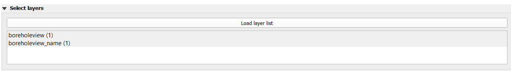

   Expected result :  1 new QGIS layer (boreholeview) and 1 table

   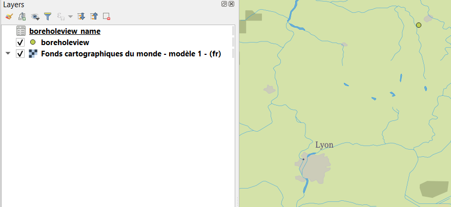

   Then QGIS 'Identify Features' on the point added ->  expected result : features attributes from the GML SHALL be displayed

3. dereferencing vocabulary
    * on INSPIRE registry

    `gsmlp:purpose/@xlink:href` ('Load' button click) > 'Options for xlink:href loading'
    - all default options EXCEPT
    - "Load layer list' : click and keep all
    - Target database > SQLite > same database as the one created in step 1 (write mode : Append)

    Expected results:
   - the content of the created database SHALL be enriched with content coming from the INSPIRE registry
    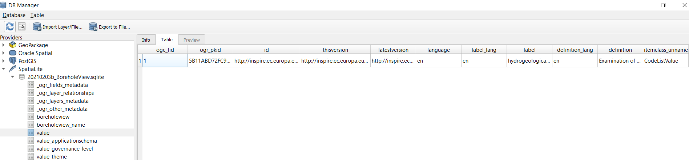
   - the Layer list SHALL be enriched with the new tables created from the import
   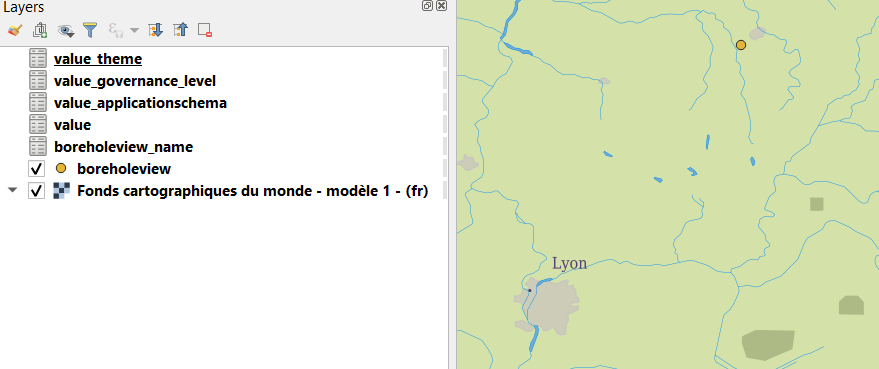

    * on OGC definition server
    proceed as above on attributes having xlink:href starting with <http://www.opengis.net/def/>...

    * on EU geological surveys linked data registry
    proceed as above on attributes having  @xlink:href starting with <http://data.geoscience.earth/ncl/>...

4. dereferencing a 1st feature (a geological log )
    gsmlp:geologicalDescription/@xlink:href >  ('Load' button click) > 'Options for xlink:href loading'
     - all default options EXCEPT
     - "Load layer list' : click and keep all
     - Target database > SQLite > same database as the one created in step 1 (write mode : Append)
     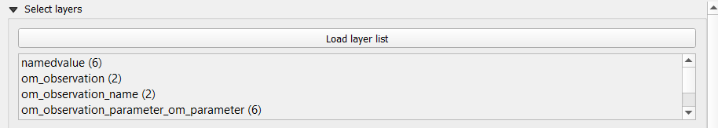

    Expected results:
   - the content of the created database SHALL be enriched with content of the geological log description
    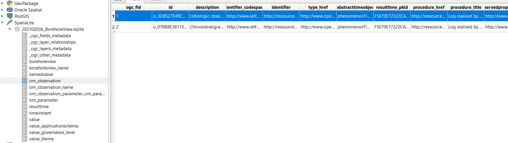
   - the Layer list SHALL be enriched with the new tables created from the import of the geological log description
   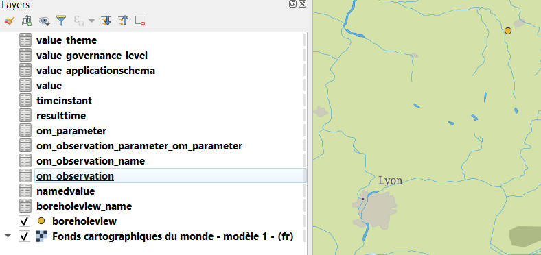

   TODO SG : check whether it's normal with the current status of the dev that the LogViewer widget is not proposed in the GUI (1st compare with what happens for the TimeSeries viewer)

5. dereferencing another Feature (a GroundWater Quantity Monitoring Facility)
    TODO SG :
      - crashed under 3.10.13 when loading layers at the time of writing
      - add a

6.  access groundwater observation
    workaround while point 5. is blocked

    On the following URL : <https://raw.githubusercontent.com/BRGM/gml_application_schema_toolbox/master/tests/basic_test_scenario/4_SOS_TimeSeries.xml>

   Load wizard > 'File/Url' > Load in relational mode (GMLAS)  > GMLAS Options
   - all default options EXCEPT
   - "Load layer list' : click and keep all
   - Target database > SQLite (write mode : Create)
   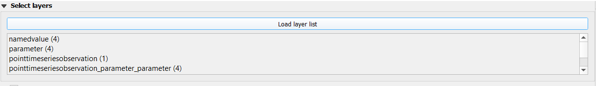

   Expected result : 8 tables added in the Layer List
   - the content of the created database SHALL be enriched with content of the TimeSeries
    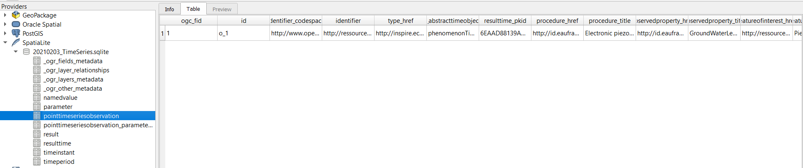
   - the Layer list SHALL be enriched with the new tables created from the import of the TimeSeries
   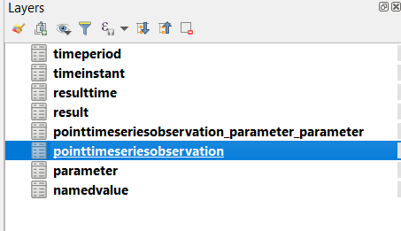

   TODO SG : check why the TimeSeries viewer is not displayed

7. access  the GroundWater ressource monitored
   workaround while point 5. is blocked

   On the following URL : <https://raw.githubusercontent.com/BRGM/gml_application_schema_toolbox/master/tests/basic_test_scenario/5_HydroGeoUnit.xml>

   Load wizard > 'File/Url' > Load in relational mode (GMLAS)  > GMLAS Options
   - all default options EXCEPT
   - "Load layer list' : click and keep all
   - Target database > SQLite (write mode : Create)
   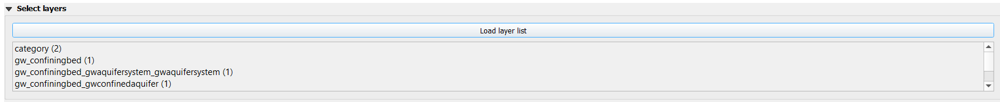

   Expected result : 8 tables added in the Layer List
   - the content of the created database SHALL be enriched with content decribing the GroundWater ressource
    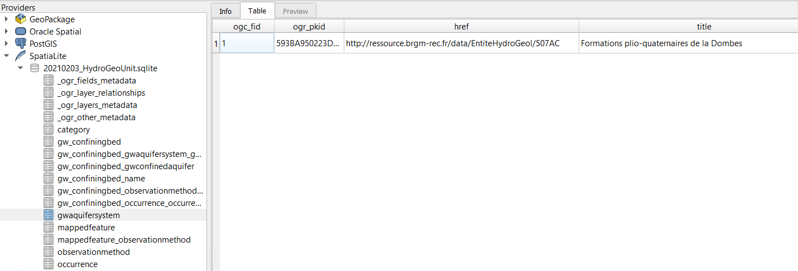
   - the Layer list SHALL be enriched with the new tables created from the import of the TimeSeries
   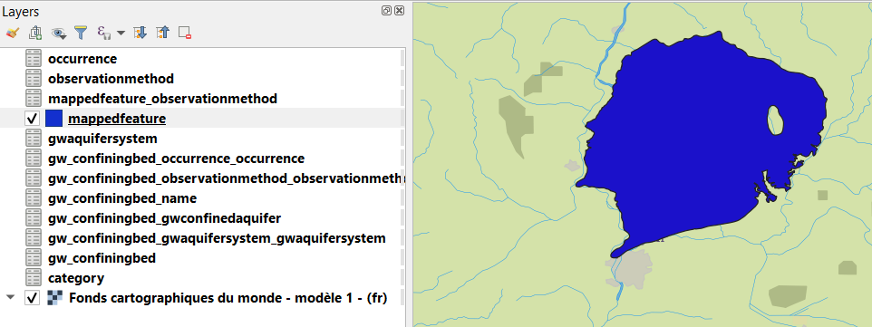
