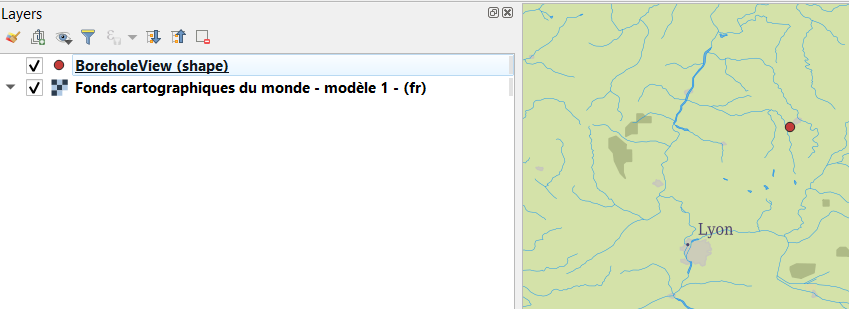
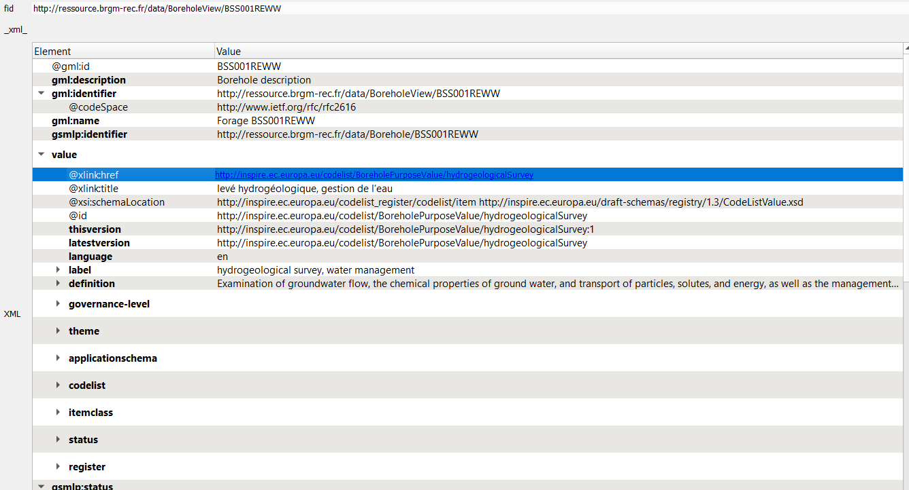
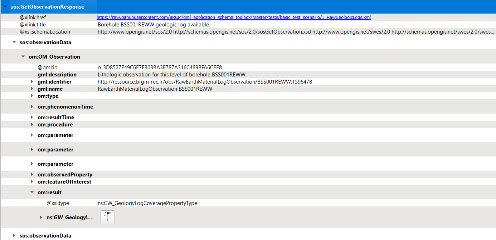

# XML Mode - local test scenario

This scenario uses files stored on GitHub to avoid potential content negociation issues (network issues) with data servers

## 1. Add a WMS background image

Whatever suits you, provided the entire world is visible (will help detect X/Y Axis being flipped).

## 2. Initial information seed

Copy the URL to the [initial information seed](https://raw.githubusercontent.com/BRGM/gml_application_schema_toolbox/master/tests/basic_test_scenario/0_BoreholeView.xml):

```txt
https://raw.githubusercontent.com/BRGM/gml_application_schema_toolbox/master/tests/basic_test_scenario/0_BoreholeView.xml
```

Then:

1. `Load wizard`
2. `File/Url` > `Load in XML Mode`
3. `XML Options : None`

**Expected result:** 1 new QGIS layer (BoreholeView (shape))



Using the QGIS tool `Identify Features` on the point added, features attributes from the GML **shall** be displayed.

## 3. Dereferencing vocabulary

### On INSPIRE registry

Locate `gsmlp:purpose/@xlink:href` and:

1. `Right click`
2. `Resolve external` > `Embedded`

**Expected result:** the content of the attribute **shall** be enriched with content coming from the INSPIRE registry



### On OGC definition server

Proceed as above on attributes having `xlink:href` starting with `http://www.opengis.net/def/`.

### On EU geological surveys linked data registry

Proceed as above on attributes having `@xlink:href` starting with `http://data.geoscience.earth/ncl/`.

## 4. Dereferencing a 1st feature (a geological log)

Locate `gsmlp:geologicalDescription/@xlink:href` and:

1. `Right click`
2. `Resolve external` > `Embedded`

**Expected result:** the content of the attribute **shall** be enriched with `sos:observationData`.

Open one of them and expand the `om:OM_Observation` then the `om:result` -> the Geology log viewer icon **shall** be proposed



### Use the Geology log viewer

Clicking on the icon next to `GW_GeologyLog` **shall** launch the Geology log viewer (preconfigured to render OGC:GroundWaterML2.0 GeologyLogCoverage compliant content):


## 5. Dereferencing another Feature (a GroundWater Quantity Monitoring Facility)

Locate `gsmlp:groundWaterLevel/@xlink:href`:

1. `Right click`
2. `Resolve external` > `As a new Layer` > Ticking `Swap X/Y`

**Expected result:** two new QGIS layers (EnvironmentalMonitoringFacility (geometry) and EnvironmentalMonitoringFacility (representativePoint))

Using the QGIS tool `Identify Features` on the point added, features attributes from the GML **shall** be displayed.

## 6. From the Monitoring facility access groundwater observation

Dereferencing hasObservation (the one whose title is `6512X0037 groundwater quantity observation collection (SOS and WaterML 2.0 format)`).

Locate `ef:hasObservation/@xlink:href` and:

1. `Right click`
2. `Resolve external` > `Embedded`

**Expected result:** the content of the attribute **shall** be enriched with sos:GetObservationResponse

Expending the om:OM_Observation then the om:result -> the Timeseries viewer icon **shall** be proposed


### Use the Timeseries viewer

Clicking on the icon next to `wml2:MeasurementTimeseries` **shall** launch the TimeSeries viewer (preconfigured to render OGC:WaterML2.0 Part 1 Timeseries compliant content):


## 7. From the Monitoring Facility add the GroundWater ressource monitored

Locate `ef:observingCapability/ef:ObservingCapability/ef:ultimateFeatureOfInterest/xlink@href` and:

1. `Right click`
2. `Resolve external` > `As a new Layer`

**Expected result:** 1 new QGIS layer GW_ConfiningBed (shape).

Move it under the other features using the 'Layers Panel' for better visibility:


## 8. interrogate the GroundWater ressource monitored

Using the QGIS tool `Identify Features` on the point added, features attributes from the GML **shall** be displayed according to OGC GWML2 Model.
