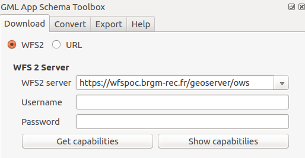
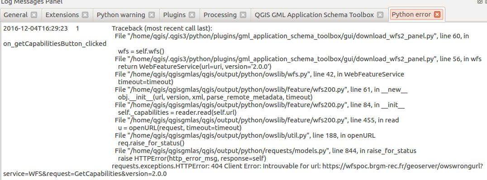
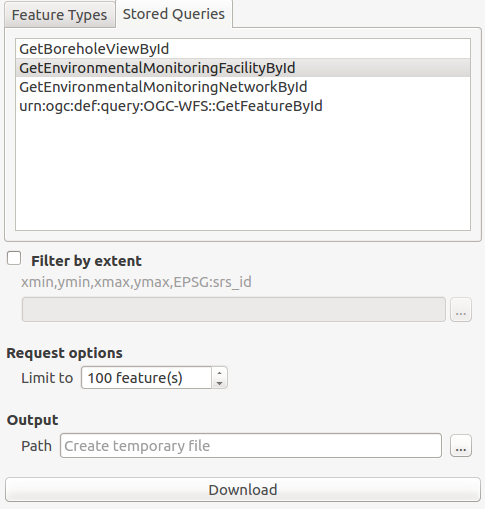
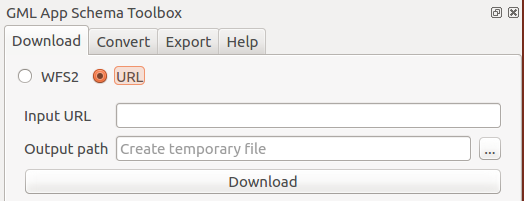

# Download GML from WFS 2 services

Source document can be GML file already available or they can be downloaded from [WFS 2.0.0 OGC services](http://www.opengeospatial.org/standards/wfs).

This part of the plugin is inspired by the work made in [QGIS WFS2 client plugin](https://github.com/JuergenWeichand/qgis-wfs20-client-plugin) but used owslib to communicate with the service.

## Connect to a service

In the `download` tab define the target service to download data from:

- `URL`: Define the service URL (without GetCapabilities). A list of sample services is available by activating the drop down.
- Authentication: If the service requires user credentials (Basic Authentication), set the following parameters:
- `Username`
- `Password`

Once set, connect to the service using the `Get capabilities` button.
The `Show capabilities` provides a simple preview of the
GetCapabilities document. After connection, the list of
`Feature Types` and `Stored Queries` are populated.

In case of error, a notification pops up with information about
the problem. Check also the log panel for more details about the error:

## Download data

To download data in GML format, set the following parameters:

- Choose a `Feature type` or a `Stored Query`
- `Filter by extent`: Define the bounding box of the area of interest
- `Request options`
- `Feature limit`: Define the maximum number of features to download
- `Output`: Define the output filename (by default, a temporary file is created in the tmp folder)

Click the `Download` button to start the download.

After download, the convert panel is activated with the path to the downloaded file.

## Download from URL

The panel can also be used to download file from a URL. This URL
could point to an existing GML file or could be a `GetFeature` request.

