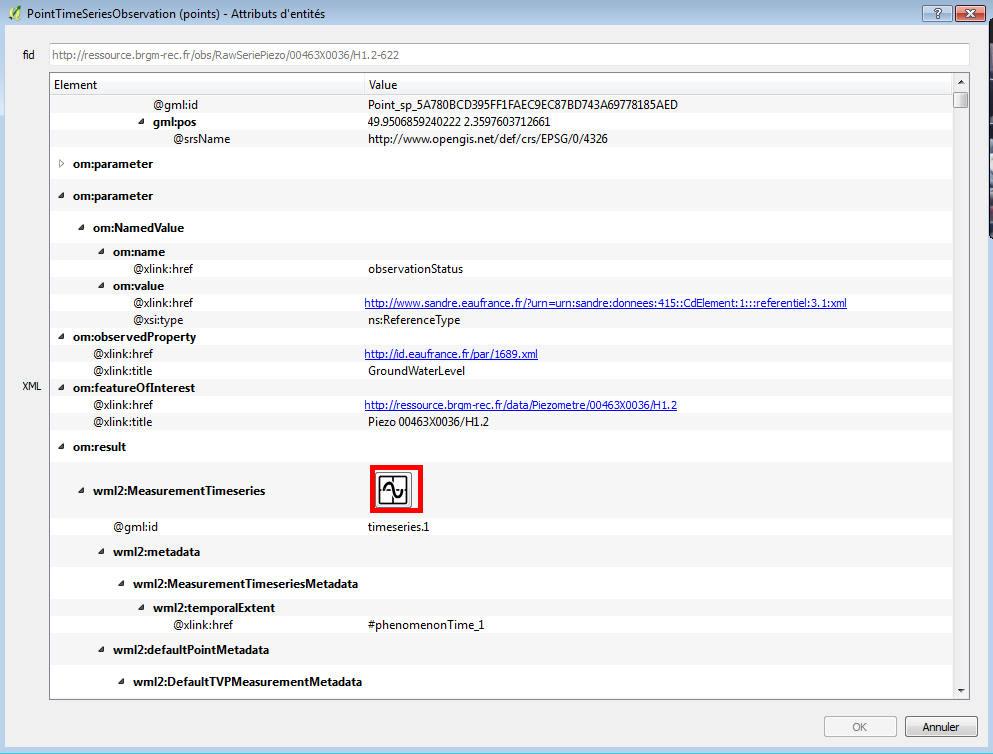
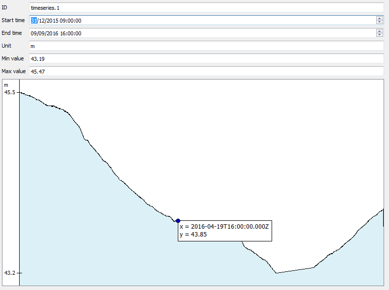

# Custom element viewers

Accessing the information contained in XML elements, either thanks to the native XML approach or thanks to the relational model approach is not always easy. Some elements may be visually displayed in a way that is more pleasant for the end user.
We have tested the idea here of custom element viewers for certain known types.

In particular, we have developed a custom viewer for the **time series of measurements** that can be found in the WaterML2 – part I : TimeSeries application schema. Such time series are represented by XML sequences of values. Plotting them as a curve should be a better representation than a raw list of time instants and values.

The idea behind this custom viewer is to offer an API that could be used by third party developers to provide custom viewer widgets for some complex types. This API is developed so that it works regardless of the value passed for the `Maximum table merging depth`.

The `time series` custom viewer is shipped with the current plugin. It is associated with `wml2:MeasurementTimeseries` elements. In both modes (native XML or relational), a button allows to display time series thanks to this custom viewer.

In XML mode

Example of the display given by the WaterML2 time series viewer

A custom viewer is made to be linked to a particular type (or table name). It receives in input a handle on the XML subtree or on the table and should return a Qt widget.
