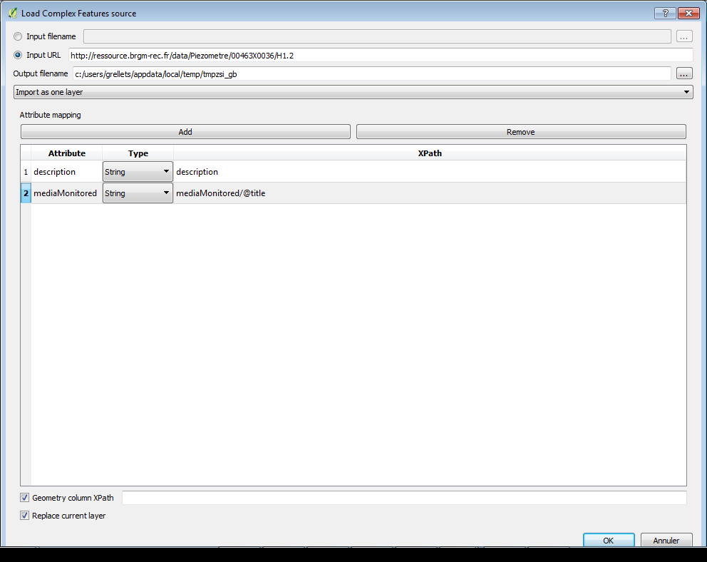
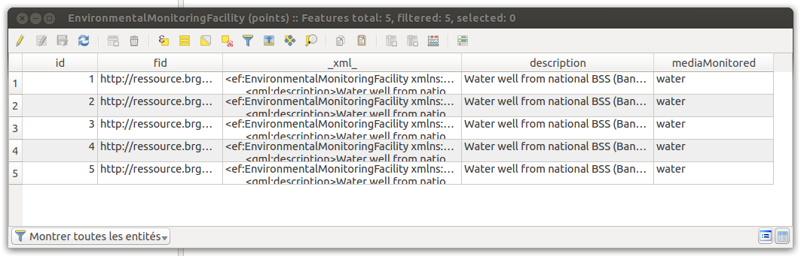
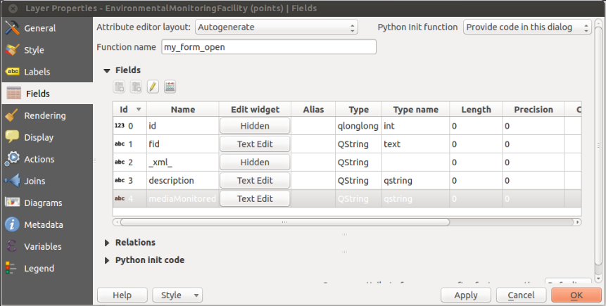
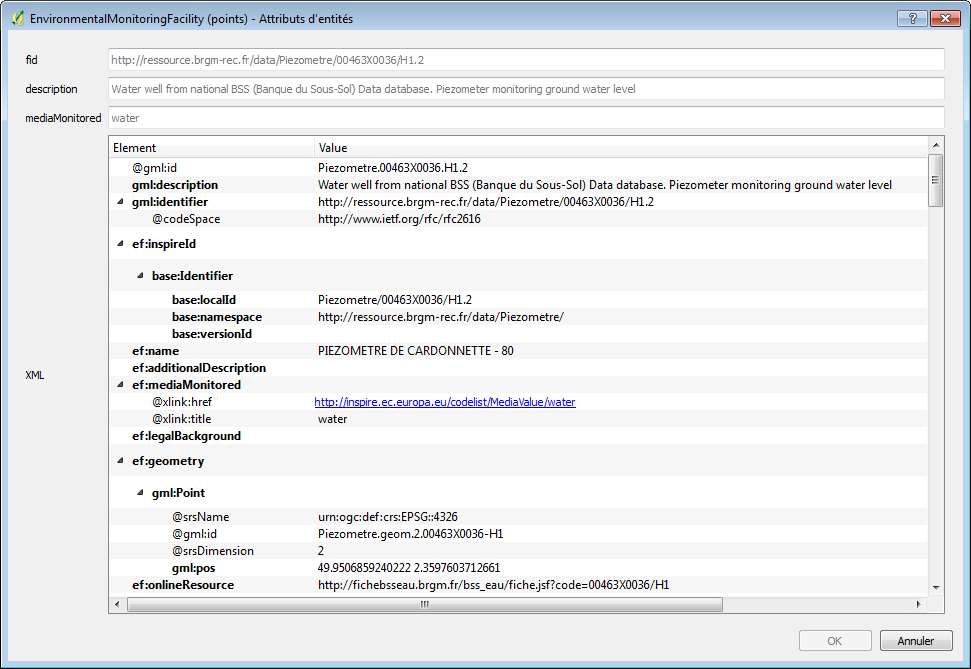
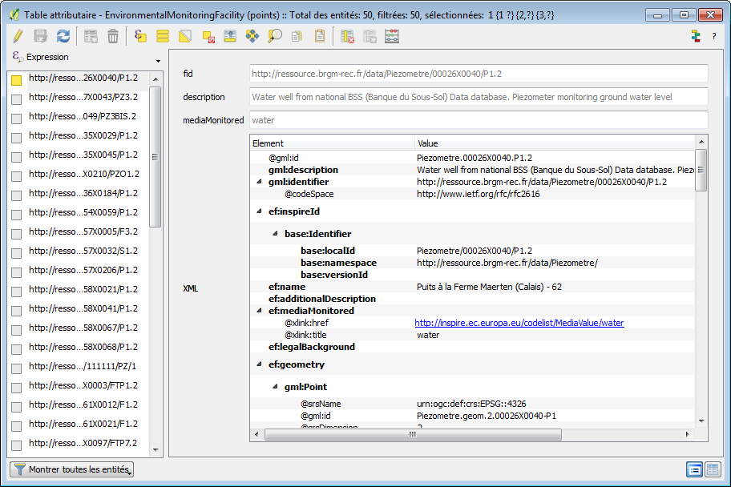
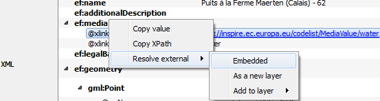
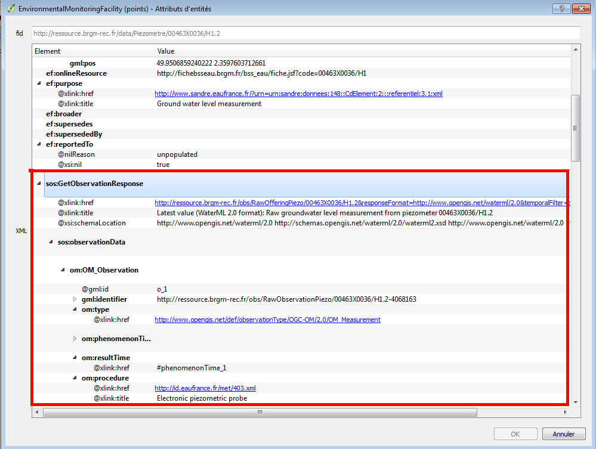

# Read GML App Schema files in XML mode

In this approach, data are seen as natively tree-like (because represented as XML) and coming from an object model.
This plugin allows then to extract each “Complex Feature” from a GML document and to store it as a row in a vector layer. It also allows to access the XML sub-tree corresponding to each feature. A special column in the vector layer allows to store the XML sub-tree as a string.

## Configure how to load the XML

The user can explicitly add new columns on the vector layer seen as “short-cuts” to data contained in the XML subtree and allowing to “flatten” the XML model. These short-cuts are expressed in the XPath language.

Upon loading, the plugin will create a new vector layer in a Spatialite file where each feature is stored with its geometry, a special column called “_xml_” to store the raw XML string and other columns if the user chose to add Xpath short-cuts.
Here is an illustration of the raw attribute table of such a vector layer:

The plugin automatically declares form widget types for each of these fields on the vector layer in order to clean the representation for the identification tool and the attribute table when opened in “form” mode.

Fields of an XML layer where the _xml_ field is declared as hidden and a custom Python init code allows to overload the default form:

## Interact with features

Given these declarations and a custom Python code that allows to overload the standard feature form generation of QGIS, the user can use standard tools of QGIS for identification and have access to the XML tree of the feature.

Example of the form displayed when the standard identification tool of QGIS is used on an XML vector layer:

Example of the attribute table of an XML vector layer in "form" mode. The XML attribute is here interpreted as an interactive tree of elements:

## Resolve external resources

The plugin also allows to resolve external resources. When right-clicking on a `xlink:href` attribute, the user may choose to download it and embed the result in the current XML tree or to populate another layer.
When dereferencing the corresponding href, the http content negociation uses:

- the current user locale as the language (HTTP header `Accept-Language`)
- `application/xml` for the HTTP `Accept` field

This approach is useful to retrieve information coming from :

- codeList registry: see example below on the Inspire registry

- retrieve a representation of a feature linked by reference. see the example below between a monitoring facility and an observation linked to it (depending on the application schema this could also be to another facility, network, aquifer, ...)

## Feature cutting up

The plugin is designed to extract a collection of Complex Features from different kinds of streams (either a local file or a remote URL):

- If the stream results from a WFS request, each subtree of the `<member>` (WFS 2.0) elements or every child of the `<featureMembers>` (WFS 1.1) element is considered as a feature

- Else, the document is considered to be an isolated feature

Besides, some application schemas also return collections of features. This is the case of streams resulting from requests to a Sensor Observation Service (each `<observationData>` is a feature)

## Handling of identifiers

Different kinds of identifiers may be found in a Complex Features stream. The XML instance will contain a `gml:id` attribute and may contain a `gml:identifier` element.

Those two types of identifier serve different purposes :

- mandatory `gml:id` provides a unique identifier within a given flow (or file)
- `gml:identifier` is not mandatory per se but is more and more used to provide an externally unique and stable identifier for a given feature (linked open data)

Note that QGIS layers should have an integer unique identifier in order to be selectable by id. So “native” identifiers (`gml:identifier` or `gml:id`) are kept as is and the primary key is set on an autoincremented integer.

## Multiple geometries

A Complex Features stream may contain more than one geometry per feature. And they can be of different types. The QGIS layer data model is more limited and one layer can only be associated to a geometry type.
In relational mode, the plugin will create different layers for each geometry type.
In XML mode, the plugin will use the **first geometry found**. If the user wants to see the other geometry types, the import has to be run again with a “geometry xpath”.

## Attribute based symbology

We present here a use case where the user wants to extract useful information from the Complex Feature stream and use it to configure the symbology of the geometry features in QGIS. Data are coming from a sample XML instance implementing the INSPIRE `EnvironmentalMonitoringFacility` theme.

In XML mode, the only currently possible way to extract data from the feature is to use QGIS to parse the `_xml_` attribute that contains the XML stream as a string.
Using a label based on an expression with something like the following would do the trick:

`regexp_substr( _xml_, '<ef:mediaMonitored[^>]*title="([^"]*)"')`

The expression relies on regular expression parsing to extract useful data from the raw XML content.
Regular expressions are not always easy to design and the text parsing required could lead to performance issues. New functions to manipulate XML streams, like XPATH resolution could be of great help here, especially since the XML tree widget allows the user to copy the Xpath of a given XML element, this can be reused easily in QGIS expressions.
