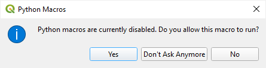
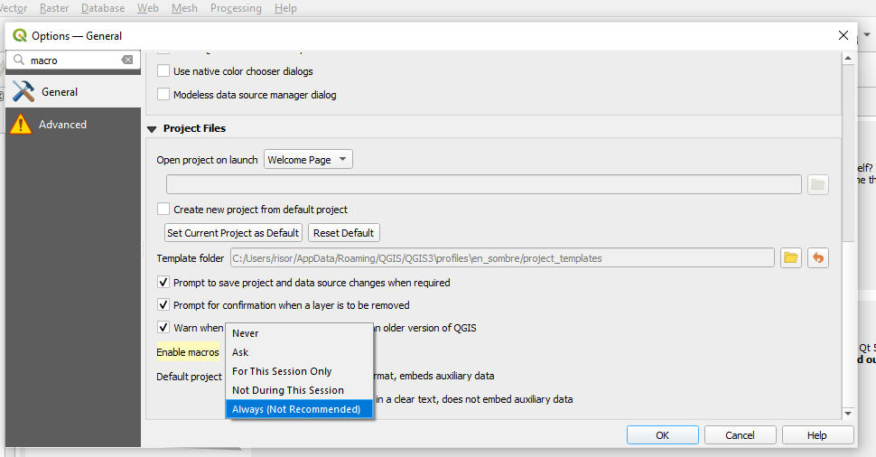

# Settings

```{info}
Settings have been renamed since version 1.4.
```

## Global

| Old name | New name   | Visible | Settable | Type    | Default |
| -------- | ---------- | :-----: | :------: | :-----: | :-----: |
|          | debug_mode |  X      | X        | boolean | False   |
|          | version    |  X      |          | string  | plugin version |

----

## Network

| Old name            | New name                | Visible | Settable | Type    | Default |
| ------------------- | ----------------------- | :-----: | :------: | :-----: | ------- |
| default_language    | network_language        | X       | X        | string  | en      |
| default_maxfeatures | network_max_features    | X       | X        | int     | 100     |
| http_user_agent     | network_http_user_agent | X       | X        | string  | plugin name and version |

----

## Usage

| Old name             | New name             | Visible | Settable | Type    | Default |
| -------------------  | -------------------- | :-----: | :------: | :-----: | ------- |
| default_access_mode  | impex_access_mode    |         | create   | string  |         |
| default_db_type      | impex_db_type        | X       | X        | string  | SQLite  |
| default_gmlas_config | impex_gmlas_config   |         |          | string  | gmlas   |
| last_import_method   | impex_import_method  | X       | X        | string  |         |
| last_downloaded_file | last_downloaded_file | X       | X        | string  |         |
| last_downloaded_path | last_downloaded_path | X       | X        | string  |         |
| last_file            | last_file            | X       | X        | string  |         |
| last_path            | last_path            | X       | X        | string  |         |
| last_source          | last_source          | X       | X        | string  |         |

----

## Related QGIS Settings

### Disable macros warning

Switching to the `Featuer form` in `Identify` leads to a warning popup:



If you don't want to see this warning, it's possible to disable it in QGIS `Settings` > `Project Files` :



> It might be a security issue. See the documentation.
