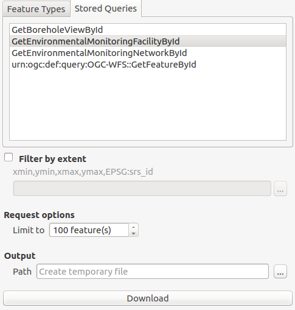

# Download GML from WFS 2 services

Source document can be GML file already available or they can be downloaded from [WFS 2.0.0 OGC services](http://www.opengeospatial.org/standards/wfs).


This part of the plugin is inspired by the work made in [QGIS WFS2 client plugin](https://github.com/JuergenWeichand/qgis-wfs20-client-plugin) but used owslib to communicate with the service.


## Connect to a service

In the ```download``` tab define the target service to download data from:

* ```URL```: Define the service URL (without GetCapabilities). A list of sample services is available by activating the drop down.
* Authentication: If the service requires user credentials (Basic Authentication), set the following parameters: 
 * ```Username```
 * ```Password```


Once set, connect to the service using the ```GetCapabilities``` button. The ```Show capabilities``` provides a simple preview of the GetCapabilities document. After connection, the list of ```Feature Types``` and ```Stored Queries``` are populated.


In case of error, a notification pops up with information about the problem:


## Download data

To download data in GML format, set the following parameters:
* Choose a ```Feature type``` or a ```Stored Query```
* ```Filter by extent```: Define the bounding box of the area of interest
* ```Request options```
 * ```Feature limit```: Define the maximum number of features to download
 * ```Output```: Define the output filename (by default, a temporary file is created in the tmp folder)

Click the ```Download``` button to start the download.



