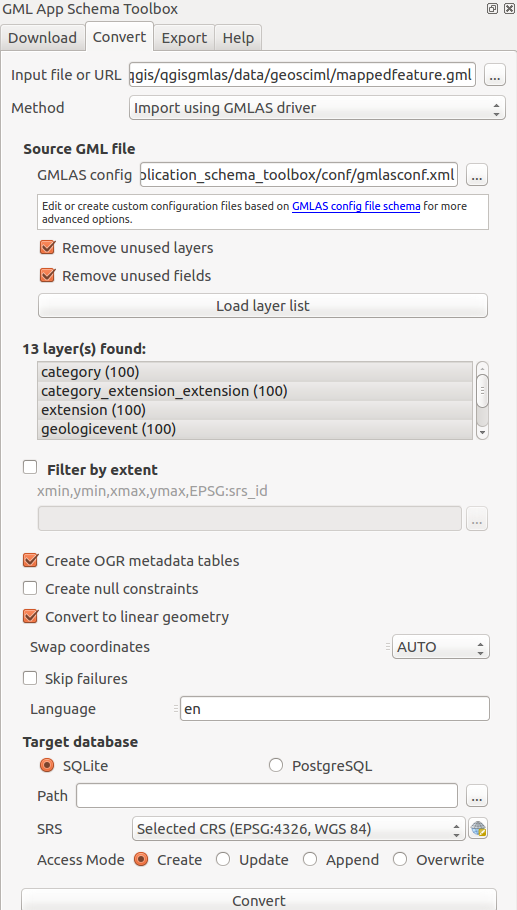

# Convert GML App Schema files in PostGIS and SQLite format

## Context

In a relational approach, the main problem is to convert from an XML flow of Complex Features instances to a relational database representation. The approach we followed consists in:

* analyzing the XSD schema(s) declared by the  XML instance in order to retrieve the underlying object model and determine the type of each element and attribute as well as links between elements;
* converting links between elements into relations between database tables;
* inserting values in the database corresponding to the values found in the XML instance;
* generating a QGIS project configured to easily manipulate the relational model.


## Using OGR GMLAS driver (default mode)

[OGR GMLAS driver](http://www.gdal.org/drv_gmlas.html) is used to analyse XSDs and create the database model corresponding to the schema.





## Using PyXB (deprecated)

This mode is deprecated and should be used only for demonstration purpose as some features are not available using GMLAS driver mode.


[PyXB](http://pyxb.sourceforge.net/) is used to analyse the input document and create the database model.


Converting an XML instance into a relational SQL model generates numerous tables and relations between them.
In order to expose the entire relational model inside QGIS, all the tables of the database must be loaded (including tables without geometries) and links between them must be declared.
QGIS has a concept of “relations” that allows to declare 1:N relations between vector layers. These relations can then be used in the form view of layers to navigate the model.
The plugin developed automatically generates a QGIS project with all the layers loaded and all the known relations declared.


Layer forms are represented with three tabs:
* a “column” tab that contains all the regular columns of the layer
* an optional “1:N links” tab that contains (recursively) linked layers
* an optional “Backlinks” tab that contains layers that point to the current layer


Note that there is no specific code to implement this form view, only proper configurations of the QGIS project.


## Relational schema visualisation

The plugin also exposes a dialog that allows to display the relational model created. It is graphically represented by the different tables with links between them represented as arrows.


On each table, a button allows to directly open the attribute table of the given layer.


For the time being only file opened with PyXB mode can use the schema view. By future work, schema view may also support any databases schema (eg. PostGIS & SQLite created by the GMLAS driver). 


## Note about XSD conversion for PyXB mode

### XSD downloading and caching

The very first step in this approach is to collect every XSD documents to properly define the whole application schema.
The starting point is the XML file passed as input. It contains namespace resolution directives that can be used to download XSD documents describing the schema. These documents may in turn have references to other XSD documents (through ```<include>``` or ```<import>```).
Because the number of XSD files to download for a given application schema may be important, they are cached in a local directory. Before trying to download XSD documents, the cache is requested.
By default the cache directory is set to a temporary directory.


### XSD to SQL conversion

Converting an XSD model, and more generally an object model into a relational model requires choices to be done, since the relational model is, in essence, poorer than a complete object model.
The basic rules used for the conversion are the following:

1. each attribute is represented by a column

2. an element with maxOccurs = “unbounded” is considered as a 1-N link. A new table will be created with a foreign key constraint

3. an element with maxOccurs = 1 is represented as a column, but only if its type is simple. If its type is complex, a new table is created with a foreign key constraint

4. elements that inherit from AbstractGeometryType are represented as a geometry column

5. if minOccurs = 0 or nillable = true, the link or the column is declared as optional (may be NULL)

6. substitution groups are processed as follows: for two types A and B of a substitution group SG, three tables SG, A and B are created. In SG, two foreign keys “a_id” and “b_id” pointing to A and B are added with a CHECK constraint that express the “exclusive or” : an SG can be either an A or B, but not both. This mechanism is generalized when there are more than two types in the substitution group.

7. If an element has an “id” attribute, it means it may be referenced by another element, through an href link. A new table is then created in that case.

Naively applying this set of rules to an XSD schema gives most of the time a huge number of tables that is very hard for the end user to figure out and manipulate.
This is due to the fact that OpenGIS schemas are very rich and contains lots of optional possibilities.
We spent some time on the conversion process in order to simplify the resulting relational model.


This leads the PyXb conversion mode to the following heuristics rules.

#### Table merging

The rule number 3 is modified so that if the compound type of an element is composed itself of unitary elements (maxOccurs=1), then a new table is not necessary and members of the element can be represented as columns by concatenation.

We then introduced an option to set the maximum number of tables than can be “merged” this way under the attribute ```Maximum table merging depth```.

#### Conversion driven by the instance

We also decided to drive the conversion based on the XML instance and not the XSD schema. It prevents the number of empty tables to grow if nothing fills them in the instance. The conversion of each complex feature may modify the current relational model by adding new columns or new tables. Tables that have been merged in a first step may also be ```unmerged``` if the merge is no longer possible.

#### Merge of unitary sequences

Some elements may be declared as sequences, resulting in the creation of a table with a foreign key. But there are lots of cases where sequences are most of the time populated with only one element. An option then allows to consider by default sequences as unitary elements (and thus merge-able). When a feature actually has more than one member in the sequence, the model is modified and a new table is created.


